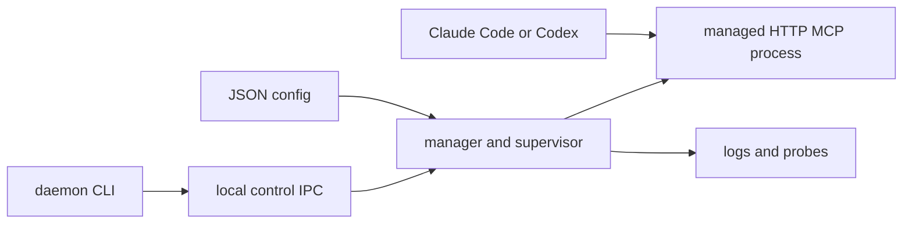

# Architecture

The daemon is a local control plane, not an MCP data path. Clients call the managed service endpoint directly.

The configuration has a single current-user daemon instance per canonical config path. The manager preserves the last-known-good configuration; supervisors own individual process state and restarts.

When changing a component boundary or a service's reconciliation effect, read [runtime ownership and reconciliation](./architecture/10-runtime-and-reconciliation.md). When reviewing daemon trust or local control, read [process and control safety](./architecture/20-process-and-control-safety.md).

Related docs: [configuration](./configuration.md), [Windows lifecycle](./windows-lifecycle.md), and the [service operations runbook](./operations/10-service-runbook.md).
